# Bot State Management Architecture Diagram

## System Overview

```mermaid
graph TB
    %% External Components
    User[👤 User/API Client]
    AdminAPI[🏢 Admin API]
    
    %% Core Services
    BotManager[🤖 Bot Manager Service]
    VexaBot[🕷️ Vexa Bot Service]
    WhisperLive[🎤 WhisperLive Service]
    
    %% Data Stores
    PostgreSQL[(🗄️ PostgreSQL Database)]
    Redis[(🔴 Redis)]
    
    %% Infrastructure
    Docker[Docker Engine]
    Nomad[Nomad Orchestrator]
    
    %% External Platforms
    GoogleMeet[📹 Google Meet]
    Zoom[📹 Zoom]
    Teams[📹 Microsoft Teams]
    
    %% Connections
    User --> BotManager
    AdminAPI --> BotManager
    BotManager --> PostgreSQL
    BotManager --> Redis
    BotManager --> Docker
    BotManager --> Nomad
    VexaBot --> Redis
    VexaBot --> WhisperLive
    VexaBot --> GoogleMeet
    VexaBot --> Zoom
    VexaBot --> Teams
    Docker --> VexaBot
    Nomad --> VexaBot
```



## Bot Lifecycle State Flow


## Redis Pub/Sub Communication

```mermaid
sequenceDiagram
    participant User as 👤 User
    participant BM as 🤖 Bot Manager
    participant Redis as 🔴 Redis
    participant VB as 🕷️ Vexa Bot
    participant Platform as 📹 Meeting Platform
    
    Note over User,Platform: Bot Startup Phase
    User->>BM: Start bot request
    BM->>BM: Create meeting record (status: requested)
    BM->>Docker: Create & start container
    BM->>BM: Update status to 'starting'
    VB->>BM: Bot started callback
    BM->>BM: Update status to 'active'
    
    Note over User,Platform: Runtime Communication
    User->>BM: Reconfigure bot
    BM->>Redis: Publish reconfigure command
    Redis->>VB: Deliver command
    VB->>VB: Update internal state
    VB->>Platform: Apply new configuration
    
    User->>BM: Stop bot
    BM->>Redis: Publish leave command
    Redis->>VB: Deliver command
    VB->>Platform: Leave meeting gracefully
    VB->>BM: Bot exit callback
    BM->>BM: Update status to 'completed'/'failed'
```



## Database Schema & State Storage


## Container Orchestration & State Management


## Redis Channel Structure

```mermaid
graph TD
    %% Redis Channels
    subgraph "Redis Pub/Sub Channels"
        BotCommands[bot_commands:{connection_id}]
        Reconfigure[reconfigure command]
        Leave[leave command]
    end
    
    %% Message Flow
    BotManager[Bot Manager] -->|Publishes| BotCommands
    BotCommands -->|Delivers| VexaBot[Vexa Bot]
    
    %% Command Types
    Reconfigure -->|action: reconfigure<br/>language: en<br/>task: transcribe| BotCommands
    Leave -->|action: leave| BotCommands
    
    %% Subscription Pattern
    VexaBot -->|Subscribes to| BotCommands
    VexaBot -->|Processes| Reconfigure
    VexaBot -->|Processes| Leave
```

## Error Handling & State Recovery


## Key Components Summary

### **Bot Manager Service**
- **State Persistence**: PostgreSQL database
- **Real-time Communication**: Redis Pub/Sub
- **Container Orchestration**: Docker/Nomad integration
- **API Management**: RESTful endpoints for bot control

### **Vexa Bot Service**
- **Command Reception**: Redis subscription to command channels
- **State Synchronization**: Callbacks to bot-manager
- **Platform Integration**: Meeting platform automation
- **Configuration Management**: Runtime reconfiguration support

### **State Management**
- **Database**: Persistent meeting and session state
- **Redis**: Real-time command delivery
- **Docker**: Container lifecycle tracking
- **Callbacks**: Bidirectional state synchronization

### **Key Features**
- ✅ **Real-time Control**: Redis Pub/Sub for immediate bot commands
- ✅ **State Persistence**: PostgreSQL for reliable state storage
- ✅ **Lifecycle Management**: Complete bot startup/shutdown flow
- ✅ **Error Recovery**: Robust error handling and state recovery
- ✅ **Multi-platform**: Support for Google Meet, Zoom, Teams
- ✅ **Runtime Reconfiguration**: Dynamic language and task updates

