# Refactored Bot State Management Architecture

## System Overview - Single Source of Truth

```mermaid
graph TB
    %% External Components
    User[👤 User/API Client]
    AdminAPI[🏢 Admin API]
    
    %% Core Services
    BotManager[🤖 Bot Manager Service]
    VexaBot[🕷️ Vexa Bot Service]
    WhisperLive[🎤 WhisperLive Service]
    
    %% Data Stores
    PostgreSQL[🗄️ PostgreSQL Database<br/>Meeting = Single Source of Truth]
    Redis[🔴 Redis<br/>Commands Only - No State]
    
    %% Infrastructure
    Docker[Docker Engine]
    Nomad[Nomad Orchestrator]
    
    %% External Platforms
    GoogleMeet[📹 Google Meet]
    Zoom[📹 Zoom]
    Teams[📹 Microsoft Teams]
    
    %% Key Principle: Bot Manager NEVER writes Meeting.status after creation
    BotManager -.->|❌ NO STATE WRITES| PostgreSQL
    BotManager -->|✅ RESERVE SLOT ONLY| PostgreSQL
    BotManager -->|✅ PUBLISH COMMANDS| Redis
    
    %% Bot owns all state transitions
    VexaBot -->|✅ STATE TRANSITIONS| PostgreSQL
    VexaBot -->|✅ HEARTBEATS| PostgreSQL
    VexaBot -->|✅ SESSION CREATION| PostgreSQL
    
    %% Other connections
    User --> BotManager
    AdminAPI --> BotManager
    BotManager --> Docker
    BotManager --> Nomad
    VexaBot --> Redis
    VexaBot --> WhisperLive
    VexaBot --> GoogleMeet
    VexaBot --> Zoom
    VexaBot --> Teams
    Docker --> VexaBot
    Nomad --> VexaBot
```



## Refactored State Machine - Bot-Owned Transitions


## Data Flow - Single Source of Truth

```mermaid
flowchart TD
    %% Bot Manager Responsibilities
    subgraph "Bot Manager (State Consumer)"
        ReserveSlot[Reserve Meeting Slot]
        StartContainer[Start Container]
        PublishCommands[Publish Redis Commands]
        ReadState[Read Meeting State]
    end
    
    %% Bot Responsibilities
    subgraph "Vexa Bot (State Owner)"
        UpdateStatus[Update Meeting Status]
        CreateSession[Create MeetingSession]
        Heartbeat[Send Heartbeats]
        HandleCommands[Handle Redis Commands]
    end
    
    %% Database - Single Source of Truth
    subgraph "PostgreSQL (Meeting Table)"
        MeetingRow[Meeting Row<br/>status, container_id,<br/>start_time, end_time]
        SessionRow[MeetingSession Row<br/>session_uid, meeting_id]
        UserRow[User Row<br/>max_concurrent_bots]
    end
    
    %% Redis - Commands Only
    subgraph "Redis (No State)"
        CommandChannels[bot_commands:{session_uid}]
        ReconfigureCmd[reconfigure command]
        LeaveCmd[leave command]
    end
    
    %% Flow
    ReserveSlot -->|INSERT status='reserved'| MeetingRow
    StartContainer -->|SET bot_container_id| MeetingRow
    PublishCommands --> CommandChannels
    ReadState --> MeetingRow
    
    UpdateStatus -->|UPDATE status| MeetingRow
    CreateSession -->|INSERT| SessionRow
    Heartbeat -->|UPDATE last_heartbeat| MeetingRow
    HandleCommands --> CommandChannels
    
    %% Key Principle
    BotManager -.->|❌ NEVER WRITES STATUS| MeetingRow
    VexaBot -->|✅ ONLY WRITES STATUS| MeetingRow
```

## Current Database Schema - No Migration Required

```mermaid
erDiagram
    USERS {
        int id PK
        string email
        string name
        string image_url
        int max_concurrent_bots "✅ Already exists"
        timestamp created_at
        jsonb data "✅ Already exists"
    }
    
    MEETINGS {
        int id PK
        int user_id FK
        string platform "✅ Already exists"
        string platform_specific_id "✅ Already exists"
        string status "✅ Already exists - will use existing values"
        string bot_container_id "✅ Already exists"
        timestamp start_time "✅ Already exists"
        timestamp end_time "✅ Already exists"
        jsonb data "✅ Already exists"
        timestamp created_at "✅ Already exists"
        timestamp updated_at "✅ Already exists"
    }
    
    MEETING_SESSIONS {
        int id PK
        int meeting_id FK
        string session_uid "✅ Already exists"
        timestamp session_start_time "✅ Already exists"
    }
    
    TRANSCRIPTIONS {
        int id PK
        int meeting_id FK
        float start_time
        float end_time
        string text
        string speaker
        string language
        string session_uid "✅ Already exists"
        timestamp created_at
    }
    
    USERS ||--o{ MEETINGS : has
    MEETINGS ||--o{ MEETING_SESSIONS : contains
    MEETINGS ||--o{ TRANSCRIPTIONS : generates
    
    note: "ALL REQUIRED FIELDS ALREADY EXIST - NO MIGRATION NEEDED"
    note: "Refactoring only changes application logic, not database structure"
```

## Database Field Mapping - Zero Migration Required

### **Current Schema vs. Refactored Requirements**

| **Refactored Need** | **Current Field** | **Status** | **Notes** |
|---------------------|-------------------|------------|-----------|
| **User max_concurrent_bots** | `users.max_concurrent_bots` | ✅ **EXISTS** | Already has default value 1 |
| **Meeting status** | `meetings.status` | ✅ **EXISTS** | Currently uses 'requested', will add new values |
| **Bot container tracking** | `meetings.bot_container_id` | ✅ **EXISTS** | Already nullable string field |
| **Meeting lifecycle** | `meetings.start_time` | ✅ **EXISTS** | Already nullable timestamp |
| **Meeting lifecycle** | `meetings.end_time` | ✅ **EXISTS** | Already nullable timestamp |
| **Session tracking** | `meeting_sessions.session_uid` | ✅ **EXISTS** | Already unique indexed |
| **Platform support** | `meetings.platform` | ✅ **EXISTS** | Already supports 'google_meet', 'zoom', etc. |
| **User isolation** | `meetings.user_id` | ✅ **EXISTS** | Already foreign key to users |

### **Status Value Mapping (No Schema Change)**

| **Current Values** | **Refactored Values** | **Action** |
|-------------------|----------------------|------------|
| `'requested'` | `'reserved'` | **Application logic change only** |
| `'active'` | `'active'` | **No change needed** |
| `'stopping'` | `'stopping'` | **No change needed** |
| `'completed'` | `'completed'` | **No change needed** |
| `'failed'` | `'failed'` | **No change needed** |
| `'error'` | `'failed'` | **Application logic change only** |
| `'starting'` | `'starting'` | **No change needed** |

### **New Status Values (No Migration)**

| **New Status** | **Purpose** | **Implementation** |
|----------------|-------------|-------------------|
| `'reserved'` | Bot Manager reserves slot | **Application logic only** |
| `'stopping'` | Bot received leave command | **Application logic only** |

### **Heartbeat Field (Optional Enhancement)**

| **Field** | **Current Status** | **Migration Required** |
|-----------|-------------------|----------------------|
| `meetings.last_heartbeat` | ❌ **NOT EXISTS** | **OPTIONAL** - Can use existing `updated_at` |

**Recommendation**: Use existing `meetings.updated_at` field for heartbeat tracking instead of adding new field.

## Bot Lifecycle - State Ownership


## API Endpoints - Read-Only State Access

```mermaid
graph TD
    %% Bot Manager APIs (State Consumers)
    subgraph "Bot Manager - State Consumer APIs"
        StartBot[POST /bots/start<br/>Reserves slot only]
        StopBot[POST /bots/stop<br/>Publishes command only]
        ReconfigureBot[PUT /bots/config<br/>Publishes command only]
        GetMeetings[GET /meetings<br/>Reads Meeting table]
        GetActiveBots[GET /bots/active<br/>Reads Meeting table]
        GetBotStatus[GET /bots/status<br/>Reads Meeting table]
    end
    
    %% Bot Callback APIs (State Owners)
    subgraph "Vexa Bot - State Owner APIs"
        StartedCallback[POST /callback/started<br/>reserved → starting]
        JoinedCallback[POST /callback/joined<br/>starting → active]
        ExitedCallback[POST /callback/exited<br/>active → completed/failed]
        HeartbeatCallback[POST /callback/heartbeat<br/>Updates updated_at]
        StatusCallback[PATCH /callback/status<br/>Sets intermediate status]
    end
    
    %% Database Operations
    subgraph "Database Operations"
        ReserveSlot[INSERT Meeting(status='reserved')]
        ReadState[SELECT * FROM Meeting]
        UpdateStatus[UPDATE Meeting SET status=?]
        CreateSession[INSERT MeetingSession]
        UpdateHeartbeat[UPDATE Meeting SET updated_at=now]
    end
    
    %% Flow
    StartBot --> ReserveSlot
    StopBot -->|Redis Command| Redis
    ReconfigureBot -->|Redis Command| Redis
    GetMeetings --> ReadState
    GetActiveBots --> ReadState
    GetBotStatus --> ReadState
    
    StartedCallback --> UpdateStatus
    StartedCallback --> CreateSession
    JoinedCallback --> UpdateStatus
    ExitedCallback --> UpdateStatus
    HeartbeatCallback --> UpdateHeartbeat
    StatusCallback --> UpdateStatus
    
    %% Key Principle
    StartBot -.->|❌ NO STATUS WRITE| UpdateStatus
    StopBot -.->|❌ NO STATUS WRITE| UpdateStatus
    ReconfigureBot -.->|❌ NO STATUS WRITE| UpdateStatus
```

## Concurrency Control - Database-Enforced Limits

```mermaid
flowchart TD
    Start([User requests bot]) --> CheckLimit{Check concurrent limit}
    
    CheckLimit -->|Within limit| ReserveSlot[Reserve meeting slot]
    CheckLimit -->|Over limit| Reject[Reject request]
    
    ReserveSlot --> Transaction[BEGIN TRANSACTION]
    Transaction --> LockUser[SELECT FOR UPDATE user row]
    LockUser --> CountActive[COUNT meetings WHERE status IN ('reserved','starting','active')]
    CountActive --> Compare{count < max_concurrent_bots?}
    
    Compare -->|Yes| InsertMeeting[INSERT Meeting(status='reserved')]
    Compare -->|No| Rollback[ROLLBACK]
    
    InsertMeeting --> Commit[COMMIT]
    Commit --> StartContainer[Start container]
    StartContainer --> Success[Success]
    
    Rollback --> Reject
    Reject --> End([End])
    Success --> End
    
    note: "Database transaction guarantees atomicity"
    note: "No Redis locks needed - DB is single source of truth"
```

## Background Cleanup - Edge Case Handling

```mermaid
flowchart TD
    Start([Background Sweeper]) --> CheckReserved{Check reserved meetings}
    
    CheckReserved -->|Older than 5 min| MarkFailed1[Mark as failed]
    CheckReserved -->|Within 5 min| CheckStarting{Check starting meetings}
    
    CheckStarting -->|Older than 10 min| MarkFailed2[Mark as failed]
    CheckStarting -->|Within 10 min| CheckActive{Check active meetings}
    
    CheckActive -->|updated_at > 2 min old| MarkFailed3[Mark as failed]
    CheckActive -->|updated_at fresh| Wait[Wait for next cycle]
    
    MarkFailed1 --> UpdateDB1[UPDATE Meeting SET status='failed', end_time=now]
    MarkFailed2 --> UpdateDB2[UPDATE Meeting SET status='failed', end_time=now]
    MarkFailed3 --> UpdateDB3[UPDATE Meeting SET status='failed', end_time=now]
    
    UpdateDB1 --> Wait
    UpdateDB2 --> Wait
    UpdateDB3 --> Wait
    
    note: "Handles edge cases where bot crashes without callbacks"
    note: "Ensures Meeting table stays accurate"
    note: "Runs every minute in background"
```

## Migration Status: ✅ ZERO MIGRATIONS REQUIRED

### **Why No Migration is Needed:**

1. **All Required Fields Exist**: Every field needed for the refactored design already exists in the current database schema.

2. **Status Field Compatibility**: The existing `status` field can accommodate all new status values without schema changes.

3. **Existing Relationships**: All necessary foreign keys and indexes are already in place.

4. **Data Types Match**: All existing fields have the correct data types for the refactored functionality.

5. **Optional Enhancements**: The only potential enhancement (heartbeat tracking) can use existing `updated_at` field.

### **Implementation Approach:**

- **Phase 1**: Update application logic to use new status values
- **Phase 2**: Modify bot-manager to never write status after creation
- **Phase 3**: Update vexa-bot to own all state transitions
- **Phase 4**: Use existing `updated_at` field for heartbeat tracking

### **Risk Assessment: LOW**

- **No schema changes**: Zero risk of data loss or corruption
- **Backward compatible**: Existing data remains valid
- **Rollback safe**: Can revert to current logic if needed
- **Incremental deployment**: Can implement changes gradually

## Key Benefits of Refactoring

### **Single Source of Truth** 🎯
- **Meeting table**: Only place where bot state is stored
- **No Redis state**: Redis only for commands, not state
- **Bot ownership**: Only bots can change meeting status
- **Consistency**: No state synchronization issues

### **Simplified Architecture** 🏗️
- **Bot Manager**: Never writes meeting status after creation
- **Vexa Bot**: Owns all state transitions and heartbeats
- **Database**: Enforces concurrency limits transactionally
- **Redis**: Pure command bus, no state storage

### **Improved Reliability** ✅
- **Race condition free**: Database transactions prevent conflicts
- **Crash recovery**: Background sweeper handles edge cases
- **Idempotent callbacks**: Bot can retry failed state updates
- **Audit trail**: All state changes tracked in database

### **Use Case Satisfaction** 🎯
- **Max concurrent bots**: Enforced at reservation time in DB
- **Active bot list**: Simple SELECT from Meeting table
- **Meeting states**: Always accurate, managed by bots
- **User independence**: Each user's bots isolated by user_id

### **Implementation Benefits** 🚀
- **Easier debugging**: Single place to check bot state
- **Better monitoring**: Database queries for all bot metrics
- **Simplified testing**: No Redis state to mock
- **Scalability**: Database handles concurrency, Redis handles commands
- **Zero migration risk**: All changes are application logic only
